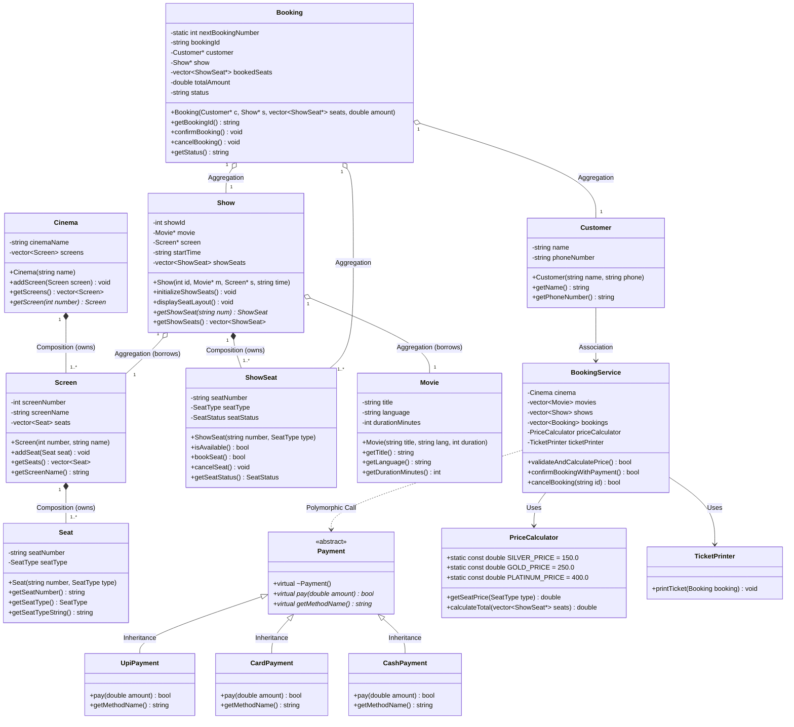
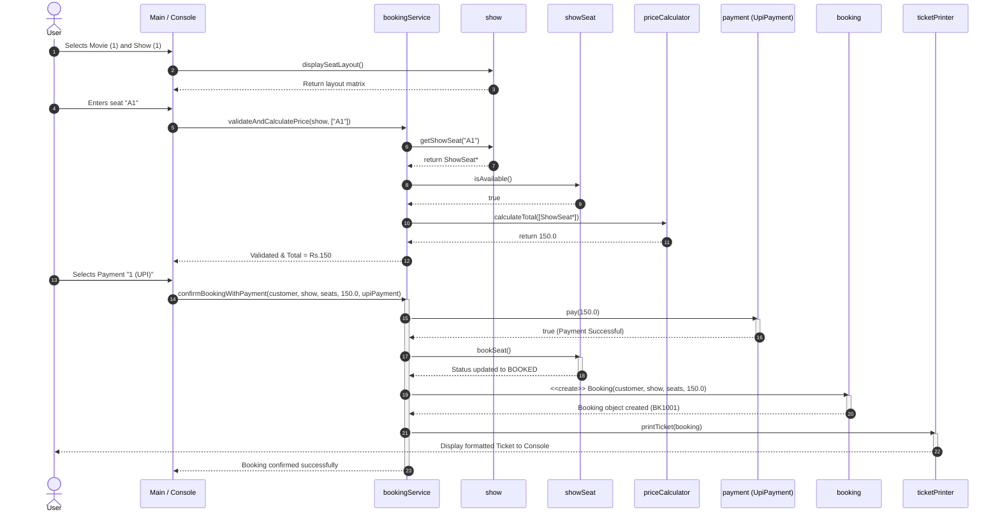

# Assignment 1: Movie Ticket Booking System
**Course:** B.Tech. CSE | **Semester:** 5  
**Subject:** System Design | **Subject Code:** TCS-504  
**Submission Date:** 07-September-2026  

---

## 1. The Problem Statement
Build a small movie ticket booking system for a single cinema (like PVR or INOX), as a menu-driven C++ console program.  
A customer should be able to see which movies are playing, pick a show, see which seats are free, book seats, pay, get a ticket, and cancel a booking.

---

## 2. Scope & Features Built (8/8)
- **F1:** List all movies currently playing
- **F2:** For a chosen movie, list its shows (screen + start time)
- **F3:** For a chosen show, display seat layout with `AVAILABLE [ ]` / `BOOKED [X]` status
- **F4:** Book one or more seats for a show (reject an already-booked seat)
- **F5:** Price the booking by seat type: `SILVER ₹150`, `GOLD ₹250`, `PLATINUM ₹400`
- **F6:** Pay by UPI, Card or Cash — a failed payment must NOT confirm the booking
- **F7:** Print a ticket: booking id, movie, screen, time, seat numbers, total amount
- **F8:** Cancel a booking — the seats become `AVAILABLE` again

---

## 3. Step A — Requirement Analysis

### Functional Requirements (FR)
- **FR1 — Movie Listing:** The system shall display the list of all currently screening movies, including title, language, and duration in minutes.
- **FR2 — Show Selection:** Given a selected movie, the system shall list all available shows with their assigned auditorium screen number and start time.
- **FR3 — Seat Layout Display:** Given a selected show, the system shall display the current seating matrix arranged by tier (`SILVER`, `GOLD`, `PLATINUM`), clearly marking each seat as `AVAILABLE [ ]` or `BOOKED [X]`.
- **FR4 — Seat Booking (Standard):** A customer selects one or more seat numbers for a show. If any selected seat is already BOOKED, the whole booking is rejected and no seat changes state. Booking is confirmed only after payment succeeds.
- **FR5 — Pricing Calculation:** The system shall calculate the total ticket amount based strictly on seat tiers: `SILVER = ₹150`, `GOLD = ₹250`, and `PLATINUM = ₹400`.
- **FR6 — Payment Processing (Standard):** Exactly one method (`UPI` / `Card` / `Cash`) per booking. If payment fails, seats are released and booking status becomes `FAILED`.
- **FR7 — Ticket Generation:** Upon successful payment, the system shall generate and print a ticket containing a unique booking ID, movie title, screen name, show time, seat identifiers, total amount, and confirmation status.
- **FR8 — Booking Cancellation:** A customer can cancel a booking using its booking ID. Upon cancellation, the booking status changes to `CANCELLED` and all associated seats immediately revert to `AVAILABLE [ ]`.

### Non-Functional Requirements (NFR)
1. **NFR1 — Modularity (One Class Per File):** Each conceptual class must reside in its own dedicated source file without monolithic coupling, enforcing high cohesion and separation of concerns.
2. **NFR2 — Extensibility (Open-Closed Principle):** Adding a new payment method (e.g., `NetBankingPayment`) must require creating only a new derived class without modifying existing classes or `BookingService`.
3. **NFR3 — Robust Input Validation:** The system must gracefully handle invalid inputs (such as malformed menu choices, non-existent seat numbers, or empty selections) with user-friendly error messages and zero runtime crashes.
4. **NFR4 — State Consistency & Atomicity:** Booking operations must be atomic: if payment fails or an error occurs during selection, the seating state must remain unmodified (no partial bookings).

---

## 4. Step B — Noun–Verb Analysis

### Noun Analysis Table (Extracting Entity & Service Classes)

| Noun Found | Keep as a Class? | Architectural Reason |
| :--- | :--- | :--- |
| **Movie** | **Yes** | Has its own persistent identity and data (title, language, duration). |
| **Seat** | **Yes** | Represents a physical auditorium chair with number and tier type. |
| **"seat layout"** | **No** | It is a dynamic view/matrix of a Show's seats, not an entity $\rightarrow$ a display method inside `Show`. |
| **Screen** | **Yes** | Represents an auditorium that physically houses and owns a collection of seats. |
| **Cinema** | **Yes** | Represents the physical theatre entity owning multiple screens. |
| **Show** | **Yes** | Represents a temporal screening binding a Movie, Screen, and time slot. |
| **ShowSeat** | **Yes** | Represents the dynamic state (`AVAILABLE`/`BOOKED`) of a seat for a specific show run. |
| **Customer** | **Yes** | Represents the user interacting with the system with identity attributes (name, phone). |
| **Booking** | **Yes** | Represents a confirmed reservation transaction record with unique ID and state. |
| **Payment** | **Yes** | An abstraction defining the payment contract for various financial gateways. |
| **Ticket** | **No** | Formatted printable output of a Booking record $\rightarrow$ handled by `TicketPrinter`. |
| **PriceCalculator**| **Yes** | Utility service encapsulating pricing rules and tier calculations. |
| **TicketPrinter** | **Yes** | Utility service dedicated solely to formatting and printing tickets (Single Responsibility). |
| **BookingService** | **Yes** | Core orchestrator coordinating domain entities, payments, and workflow state. |

### Verb Analysis Table (Extracting Methods)

| Verb in Problem Statement | Associated Class | Corresponding Method |
| :--- | :--- | :--- |
| List movies | `BookingService` | `getMovies()` |
| List shows | `BookingService` / `Show` | `getShowsForMovie(int movieIndex)` |
| Display seat layout | `Show` | `displaySeatLayout()` |
| Calculate price | `PriceCalculator` | `calculateTotal(vector<ShowSeat*>)` |
| Pay amount | `Payment` / `UpiPayment` | `pay(double amount)` |
| Book seat | `ShowSeat` / `BookingService`| `bookSeat()`, `confirmBookingWithPayment()` |
| Print ticket | `TicketPrinter` | `printTicket(const Booking&)` |
| Cancel booking | `Booking` / `ShowSeat` | `cancelBooking()`, `cancelSeat()` |

---

## 5. Step C & D — Class Responsibilities & Relationship Table

### Class Responsibility Summary

| Class | What it KNOWS (Attributes) | What it DOES (Methods) | What it must NOT DO |
| :--- | :--- | :--- | :--- |
| **Movie** | Title, language, duration | Exposes movie metadata | Must not manage screenings or tickets |
| **Seat** | Physical seat number, seat tier | Exposes seat configuration | Must not track booking availability |
| **Screen** | Screen number, screen name, physical seats | Adds seats, provides seat layout | Must not manage show timings or prices |
| **Cinema** | Cinema name, list of screens | Manages auditoriums | Must not handle bookings or payments |
| **Show** | Show ID, Movie*, Screen*, start time, ShowSeats | Initializes show seats, displays layout | Must not process payments or write tickets |
| **ShowSeat** | Seat number, tier, availability status | Books seat, releases seat | Must not calculate order total or bill users |
| **Customer** | Name, phone number | Exposes customer profile | Must not modify cinema inventory |
| **Booking** | Booking ID, Show*, seats list, total amount, status | Records transaction, cancels booking | Must not format console text or print tickets |
| **Payment** | Payment contract interface | `pay(amount)` pure virtual | Must not decide seat availability |
| **PaymentTypes**| Gateway details (UPI/Card/Cash) | Executes specific payment method | Must not create bookings |
| **PriceCalculator**| Tier rates (`SILVER`, `GOLD`, `PLATINUM`)| Computes itemized and total price | Must not deduct funds or store tickets |
| **TicketPrinter** | Formatting templates | Formats and prints ticket to console | Must not modify booking status or price |
| **BookingService**| Cinema, movies, shows, bookings repository | Orchestrates booking/cancellation flow | Must not print raw tickets directly (delegates) |

### Relationship Table with Lifetime Test Justification

| Pair | Relationship Choice | Lifetime Test Justification ("If whole is destroyed, does the part die?") |
| :--- | :--- | :--- |
| **Cinema — Screen** | **Composition (◆)** | **Yes.** A screen is a physical auditorium inside the cinema. If the Cinema building is destroyed/demolished, all its Screens cease to exist. |
| **Screen — Seat** | **Composition (◆)** | **Yes.** Physical seats are permanently bolted inside the screen auditorium. If the Screen is demolished, its physical chairs are destroyed. |
| **Show — Movie** | **Aggregation (◇)** | **No.** A Show borrows a Movie for a time slot. If the 6:00 PM Show is cancelled or deleted, the Movie *"3 Idiots"* still exists and can be screened at 9:00 PM. |
| **Show — Screen** | **Aggregation (◇)** | **No.** A Show temporarily books an auditorium. If the Show is removed, the physical Screen remains intact. |
| **Show — ShowSeat** | **Composition (◆)** | **Yes.** `ShowSeat` represents the seat availability state *for that specific show screening*. If the Show is deleted, its specific seat availability instances die with it. |
| **Booking — Customer**| **Aggregation (◇)** | **No.** A Booking references the Customer who made it. If a Booking is deleted or cancelled, the Customer record/person does not cease to exist. |
| **Booking — ShowSeat**| **Aggregation (◇)** | **No.** A Booking holds pointers to the seats reserved. If a Booking is cancelled/destroyed, the `ShowSeat`s do not die; they simply revert to `AVAILABLE`. |
| **Booking — Payment** | **Association (──▶)**| **No.** A Booking triggers a Payment transaction via the `Payment` interface; neither owns the lifetime of the other. |
| **Payment — UpiPayment**| **Inheritance (──▷)**| **IS-A relationship.** `UpiPayment` is a specialized subtype of the abstract base `Payment` class implementing `pay(double amount)`. |
| **BookingService — Booking**| **Aggregation (◇)** | **No.** `BookingService` manages and stores `Booking` records in memory. If a service operation finishes, historical booking objects persist in memory. |

---

## 6. Step E — Class Diagram



---

## 7. Step F — Sequence Diagram ("Customer books 1 seat and pays by UPI")



---

## 8. Step G — Modular Code & OOP Verification

### File Structure (14 Files - No Header Files Rule Followed)
```
movie_ticket_system/
│
├── 01_Movie.cpp            -> Movie entity class
├── 02_Seat.cpp             -> Physical Seat entity class & SeatType enum
├── 03_Screen.cpp           -> Screen auditorium owning physical Seats (Composition)
├── 04_Cinema.cpp           -> Cinema theatre owning Screens (Composition)
├── 05_Show.cpp             -> Screening entity owning ShowSeats & referencing Movie/Screen
├── 06_ShowSeat.cpp         -> Show-specific seat state (Encapsulated status)
├── 07_Customer.cpp         -> Customer entity class
├── 08_Booking.cpp          -> Booking record with static unique ID generation
├── 09_Payment.cpp          -> Abstract Payment interface (Abstraction)
├── 10_PaymentTypes.cpp     -> UpiPayment, CardPayment, CashPayment (Inheritance & Polymorphism)
├── 11_PriceCalculator.cpp  -> Pricing service with tiered pricing constants
├── 12_TicketPrinter.cpp    -> Single-responsibility ticket formatter
├── 13_BookingService.cpp   -> Flow orchestrator with seat validation & rollback
└── main.cpp                -> Menu loop with input validation & exception safety
```

### Verification of 10 Required OOP Concepts

1. **Encapsulation:**  
   `ShowSeat::seatStatus` and `Booking::totalAmount` are private; modified strictly via controlled methods `bookSeat()`, `cancelSeat()`, and validated constructors.
2. **Abstraction:**  
   `Payment` is an abstract base class featuring pure virtual method `virtual bool pay(double amount) = 0;`.
3. **Inheritance:**  
   `UpiPayment`, `CardPayment`, and `CashPayment` derive publicly from `Payment`.
4. **Runtime Polymorphism:**  
   `Payment* payment; payment->pay(totalAmount);` dynamically dispatches to concrete gateway implementations at runtime.
5. **Compile-Time Polymorphism:**  
   Overloaded constructors in `Movie`, `Seat`, `Show`, `Customer` and overloaded `calculateTotal()` methods in `PriceCalculator`.
6. **Static Members:**  
   `inline static int nextBookingNumber = 1001;` inside `Booking` automatically generates sequentially unique booking IDs (`BK1001`, `BK1002`).
7. **`this` Keyword:**  
   Explicitly utilized inside all class constructors and setters (`this->title = title;`, `this->durationMinutes = durationMinutes;`).
8. **Composition:**  
   `Cinema -> Screen`, `Screen -> Seat`, and `Show -> ShowSeat` (the child lifecycle is bound to the parent).
9. **Aggregation:**  
   `Show -> Movie`, `Booking -> ShowSeat`, `Booking -> Customer` (child entities exist independently of parent containers).
10. **Association:**  
    `Customer -> BookingService` (Customer interacts with BookingService as a peer client without ownership).

---

## 9. Step H — SOLID Principles & Deliberate Omission

### SOLID Mapping

| Principle | Where & How Applied in Codebase |
| :--- | :--- |
| **S — Single Responsibility Principle** | `Booking` only holds transaction data. It does NOT format or print tickets (delegated to `TicketPrinter`), nor does it compute pricing (delegated to `PriceCalculator`). |
| **O — Open/Closed Principle** | Adding a new payment gateway (e.g. `CryptoPayment` or `NetBankingPayment`) only requires adding a new subclass deriving from `Payment` without modifying `BookingService` or existing payment classes. |
| **L — Liskov Substitution Principle** | Any instance of `Payment*` (`UpiPayment`, `CardPayment`, `CashPayment`) can be passed to `BookingService::confirmBookingWithPayment` without special handling or type checking. |
| **I — Interface Segregation Principle** | The `Payment` interface contains only what is universally required by all payment methods (`pay(amount)` and `getMethodName()`), rather than forcing methods like `refund()` or `scanQrCode()` on all types. |
| **D — Dependency Inversion Principle** | High-level `BookingService` depends on the abstract `Payment` interface, not on concrete classes like `CardPayment` or `UpiPayment`. |

### One Thing Deliberately NOT Done
**Deliberate Omission: Merging `ShowSeat` into physical `Seat`.**  
- **Rationale:** A physical chair `A1` exists once in auditorium `Screen-1`. However, its booking status (`AVAILABLE` vs `BOOKED`) varies across showtimes (it can be booked at 6:00 PM but free at 9:00 PM). Storing `isBooked` directly on `Seat` would corrupt seat state across multiple shows or require cloning entire auditoriums. Keeping `Seat` as an immutable physical specification and `ShowSeat` as a show-specific temporal status preserves pure object-oriented design and normalization.

---

## 10. Demo Run & Edge Case Execution Output

### 1. Standard Booking & Ticket Generation (Matches Expected Output)
```
===== MOVIE TICKET BOOKING =====
1. Movies  2. Book  3. Cancel  4. My tickets  0. Exit
Choose: 1

[1] 3 Idiots	Hindi	170 min
[2] Interstellar	English	169 min

===== MOVIE TICKET BOOKING =====
1. Movies  2. Book  3. Cancel  4. My tickets  0. Exit
Choose: 2

[1] 3 Idiots	Hindi	170 min
[2] Interstellar	English	169 min

Choose movie: 1
[1] Screen-1  06:00 PM
[2] Screen-2  09:00 PM
Choose show: 1

Screen-1  06:00 PM | 3 Idiots
SILVER   A1[ ] A2[X] A3[ ] A4[ ] 
GOLD     B1[ ] B2[ ] B3[X] 
PLATINUM C1[ ] C2[ ] 

( [ ] = available  [X] = booked )
Seats (e.g. A1,B2): A1,B2

A1 SILVER Rs.150
B2 GOLD Rs.250
TOTAL     Rs.400

Pay by: 1.UPI  2.Card  3.Cash  4.Simulate Failure > 1
[UPI] Rs.400 paid successfully

================ TICKET ================
Booking ID : BK1001
Movie      : 3 Idiots
Screen     : Screen-1  06:00 PM
Seats      : A1, B2
Amount     : Rs.400    Status: CONFIRMED
========================================
```

### 2. Edge Case 1: Booking an Already-Booked Seat
```
Seats (e.g. A1,B2): A2
Error: Seat A2 is already BOOKED.
Booking rejected. No seats were changed.
```

### 3. Edge Case 2: Failed Payment (Rollback & Release)
```
Seats (e.g. A1,B2): A1
A1 SILVER Rs.150
TOTAL     Rs.150

Pay by: 1.UPI  2.Card  3.Cash  4.Simulate Failure > 4
[Payment Gateway] Transaction declined for Rs.150
Payment failed! Booking NOT confirmed. Seats remain available.
```

### 4. Edge Case 3: Booking Cancellation (Reverts Seat to Available)
```
===== MOVIE TICKET BOOKING =====
1. Movies  2. Book  3. Cancel  4. My tickets  0. Exit
Choose: 3
Enter Booking ID to cancel (e.g. BK1001): BK1001
Booking BK1001 cancelled successfully! Seats are now AVAILABLE.

Screen-1  06:00 PM | 3 Idiots
SILVER   A1[ ] A2[X] A3[ ] A4[ ] 
GOLD     B1[ ] B2[ ] B3[X] 
PLATINUM C1[ ] C2[ ] 
```

### 5. Edge Case 4: Invalid Inputs & Error Recovery
```
===== MOVIE TICKET BOOKING =====
1. Movies  2. Book  3. Cancel  4. My tickets  0. Exit
Choose: 9
Invalid menu option. Please try again.

Choose: abc
Invalid choice! Please enter a number from the menu.

Seats (e.g. A1,B2): Z99
Error: Seat Z99 does not exist.
Booking rejected. No seats were changed.
```
